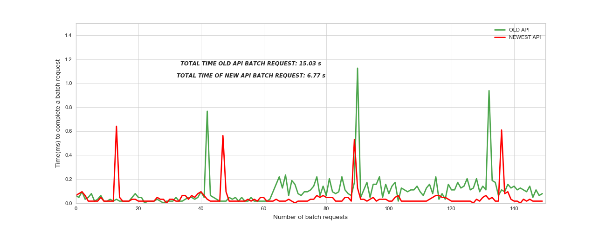

# Task - DevOps Engineer 

### Table of Contents

1. [Descrição e melhorias aplicadas](#desc)
    - 1.1 [Solução anterior](#sol_ant)
    - 1.2 [Otimização da API](#otim)
    - 1.3 [Análise do desempenho obtido](#result)
    - 1.4 [Possíveis modificações futuras](#future)
    
2. [Instruções de uso ](#instruct)
    - 2.1 [Pré-requisitos](#pre_requisits)
    - 2.2 [Tarefa 1](#task_1)
    - 2.2 [Tarefa 2](#task_2)

## 1.0 Descrição e melhorias aplicadas

### 1.1 Solução anterior

A API anterior contava com o recebimento de solicitações **GET** por meio de um single-thread e de 
forma síncrona, ou seja, cada solicitação é recebida, processada e por fim atendida. 

O processamento de cada solicitação inclui uma tarefa de busca em um dicionário em memória.
Dado um texto, é necessário identificar todos os registros que possuem as palavras contidas no 
texto buscado. 
Em todos os casos, essa busca possui complexidade **O(X*N)**, no qual: 

    X: Quantidade de palavras existentes no texto de busca.
    N: Quantidade de registros do dicionário.

### 1.2 Otimização da API
As primeiras modificações realizadas em relação ao codigo original foram: 

* Reescrita do código, adotando conceitos de programação funcional.

* Paralelismo no recebimento de requisições através de sub-processos.

* Alteração do algoritmo de busca, 
com o objetivo de tornar o algoritmo menos complexo no quando analisado o custo computacional:
    * A cada iteração, o algoritmo diminui o espaço de busca utilizado, conforme restrições impostas em iterações anteriores. 

* Adoção de arquivos de configuração .yml para facilitar a mudança de variáveis posteriormente.
 

### 1.3 Possíveis modificações futuras 

* Construção de um dicionário que é populado conforme a chegada de novas requisições:
a adoção desta solução tem finalidade de atuar como um cache, 
afim de reduzir a complexidade computacional da busca a O(1) no melhor caso (se o mesmo texto já foi buscado anteriormente).
               
    > Ponto positivo: A complexidade computacional de 
    requisições com valores frequentes é O(1)
   
    > Ponto negativo: Ocupa mais memória.*
    
    > Desafios: Arquitetar uma solução com IPC por meio de semáforos, visando assegurar a integridade do cache. Além disso, 
    identificar e tratar momentos em que a API apresenta latência fora da média.

### 1.3 Análise do desempenho obtido
Foi realizado uma repetição do load test dado inicialmente. No caso, o test-stress levou em consideração repetir por 150 vezes
o load teste, visando averiguar o desempenho a longo prazo da API antiga e a recém implementada.
 

*obs.: Na simulação realizada, a API recém implementada atendeu as requisições 2.35 vezes mais rápido que a versão anterior.*

## 2.0 Instruções de uso 

### 2.1 Pré-requisitos

    > Docker configurado e disponível.
    > git instalado
    

### Tarefa 1 

Crie um novo diretório chamado **semantix_test** ou outro nome de sua preferência 
e entre através do comando **cd**:

    > mkdir <nome_diretorio>    
    > cd <nome_diretorio>

Clone o repositório em que a api está armazenada através do comando. 
Depois entre no diretório clonado: 

    > git clone https://github.com/marcosvgj/semantix_api.git
    > cd semantix_api 
    
Dentro do diretório **semantix_api** execute o seguinte comando para construir a imagem: 

    > docker build -t "semantix_test:0.1" 
  
*obs.: Este comando pode demorar um pouco, já que a imagem base utilizada é um SO com as configurações básicas.*

Apos a execução do comando a cima, inicie o container utilizando a imagem criada:

    > docker run -d -p 4000:4000 "semantix_test:0.1"

Este comando redirecionará as chamadas da porta 4000 do container para a 
porta 4000 do host. Além disso, este container foi iniciado em segundo plano 
por conta da flag **-d**. 
 
Após esta etapa, o container criado estará pronto para uso. 

Para testar se o serviço contido no docker funciona, execute uma chamada simples via curl: 

    > curl http://localhost:4000/s/city%20tour

Caso o esteja usando uma VMBox para execução do container, 
verifique o se o host utilizado para realizar as chamadas é o localhost. 
A chamada com o host diferente pode ser adquirido por meio do comando: 

    >  curl $(docker-machine ip default):4000/s/city%20tour

Para suspender o serviço, basta executar os comandos: 

    > docker ps (Averigua o ID do container)
    > docker stop <ID_Container>    

### Tarefa 1 - CD/CI

